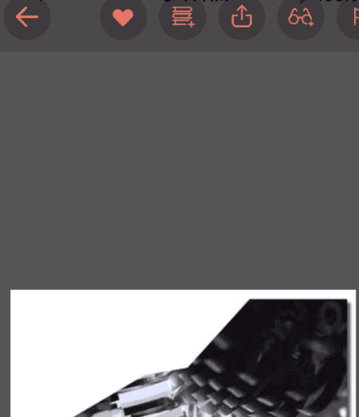

# ISUActionMenu

[](https://travis-ci.org/Samuel/ISUActionMenu)
[](http://cocoapods.org/pods/ISUActionMenu)
[](http://cocoapods.org/pods/ISUActionMenu)
[](http://cocoapods.org/pods/ISUActionMenu)



Hello, ISUActionMenu provides an "fully-customizable" interactive action menu which is similar to the action menu used by ISSUU (https://itunes.apple.com/en/app/issuu-world-magazines.-free./id914453825?mt=8).

## Example

To run the example project, clone this repo and run `pod install` from the Example directory first, the example include three demo images as the gif shown above.

## Usage

At first, you have to import `ISUActionMenuSupport`
```
#import <ISUActionMenu/ISUActionMenuSupport.h>
```
Then just add a `ISUActionMenuGestureRecognizer` object that acts as trigger gesture for the action menu, and simply initialize the gesture as:
```
   self.ActionMenuGesture = [[ISUActionMenuGestureRecognizer alloc] init];
```
The `ISUActionMenu` is highly customizable, to meet your need, initialize the action menu as:
```objC
   self.ActionMenuGesture = [[ISUActionMenuGestureRecognizer alloc]
                             initWithTarget:self
                             action:@selector(handleActionMenuGesture:)
                             initializationHandler:^ISUActionMenuView * _Nonnull {
                                 ISUActionMenuView *actionMenuView = [[ISUActionMenuView alloc] init];
                                 // eg. actionMenuView.redius = 5.0f;
                                 // The customizable properties can be referenceed from ISUActionMenuView.h
                                 return actionMenuView;
                             }];
```
With your customizable setting in `initializationHandler` like:
```
actionMenuView.indicatorPathColor = [UIColor redColor];
```
Further customizable property can be founded in `ISUActionMenuView.h`

## Installation

ISUActionMenu is available through [CocoaPods](http://cocoapods.org). To install
it, simply add the following line to your Podfile:

```ruby
pod "ISUActionMenu"
```

## Author

Samuel, citysite1025@gmail.com

## License

ISUActionMenu is available under the MIT license. See the LICENSE file for more info.
